### Information

- [Currency Codes](https://www.iban.com/currency-codes)
- [MIME TYPES](https://developer.mozilla.org/en-US/docs/Web/HTTP/Basics_of_HTTP/MIME_types/Common_types)

### Getting Started

```
docker-compose up -d
```

```
php artisan queue:work --queue=tcmb-currency
```

### Database Design

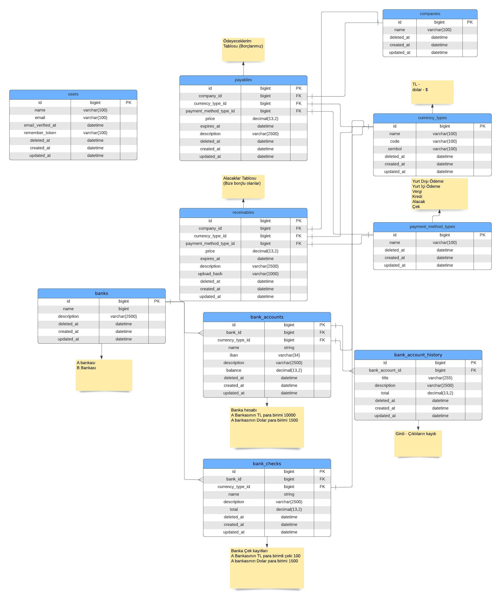

### Preview

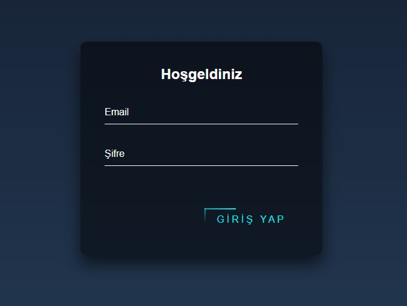
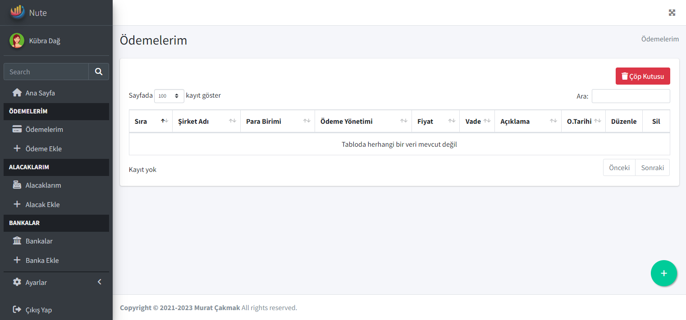
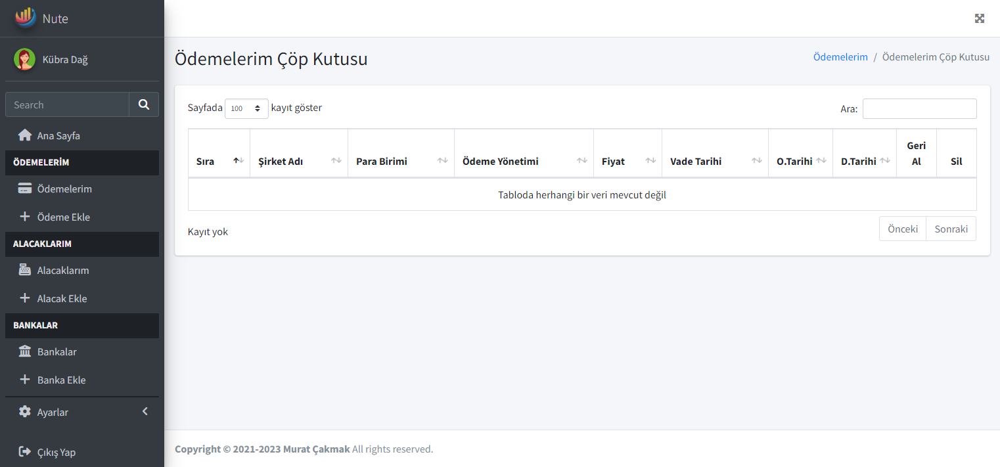
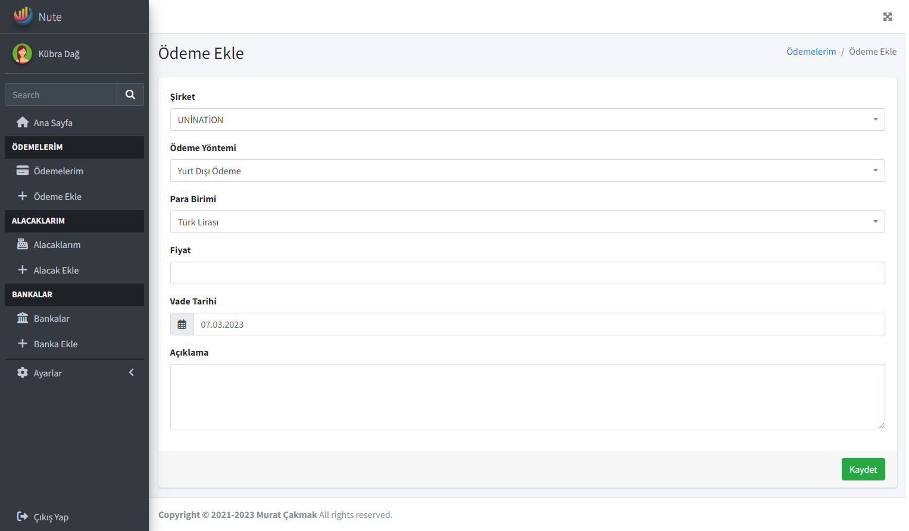
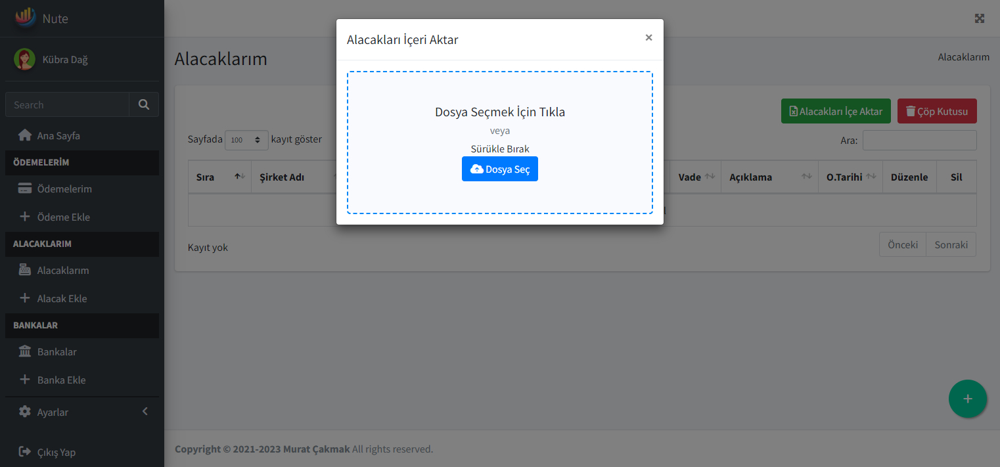
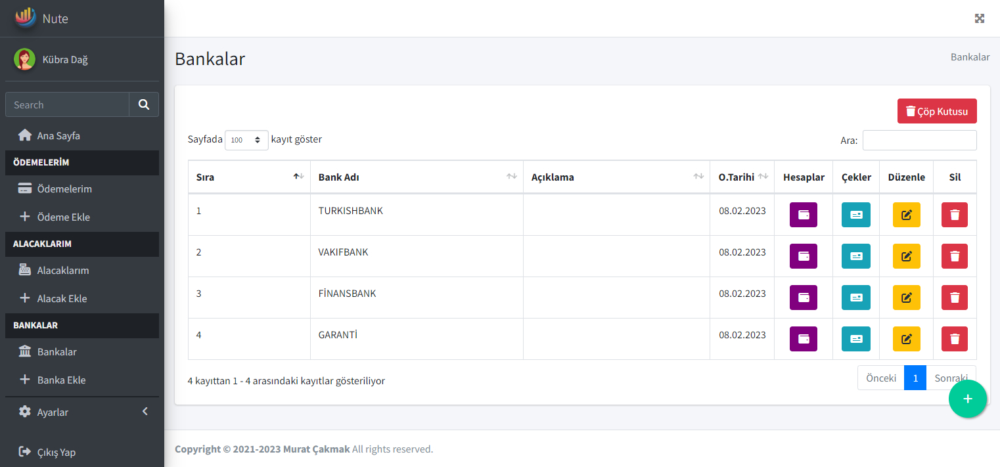
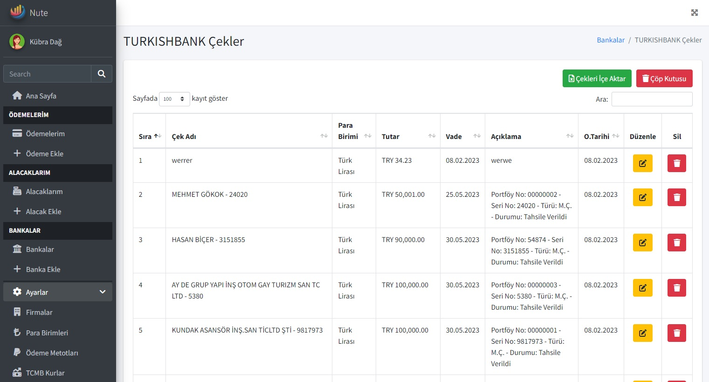
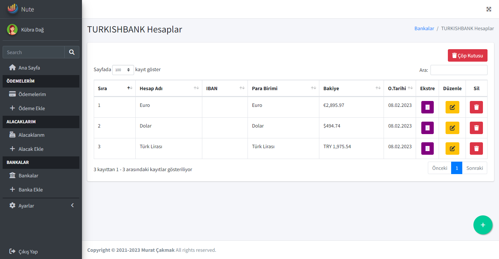
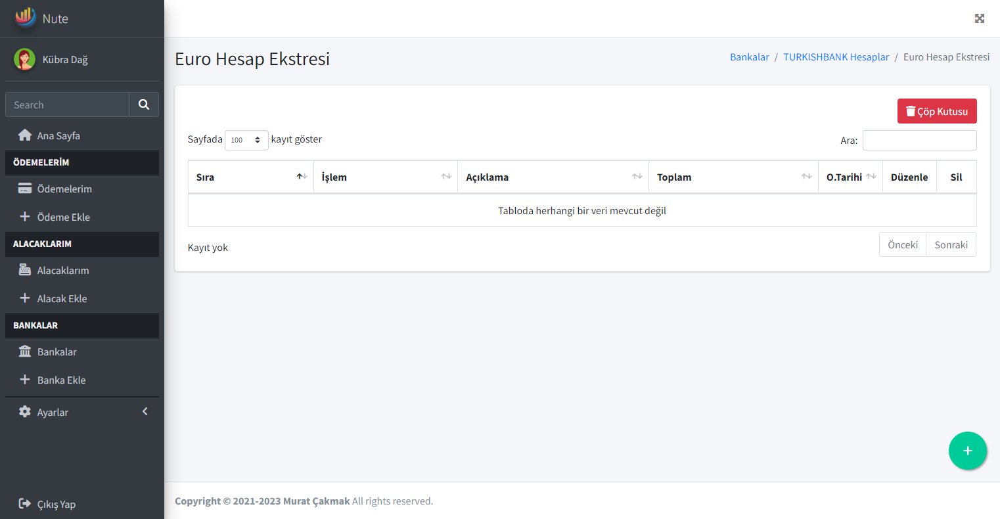
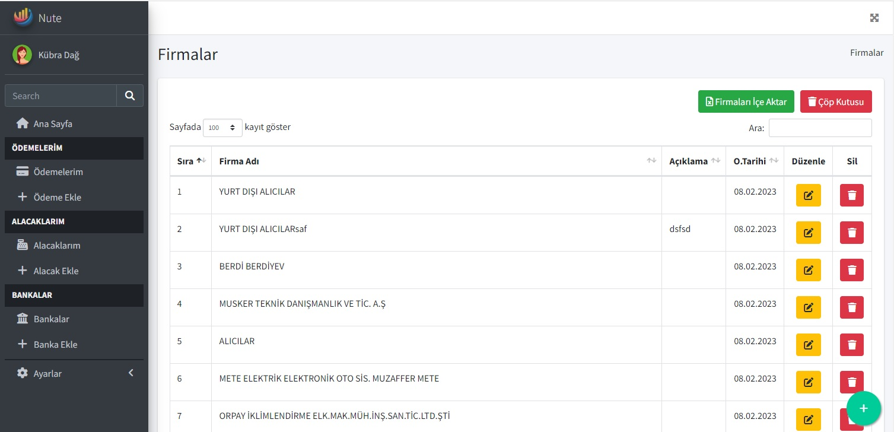
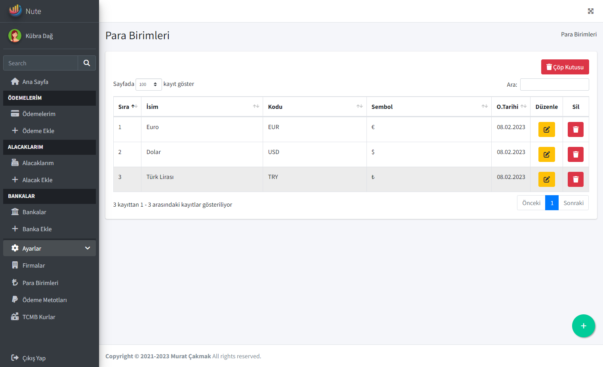
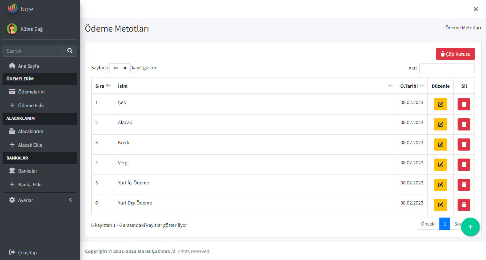
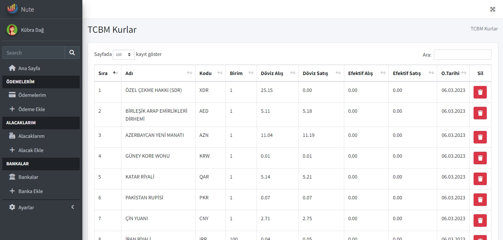
